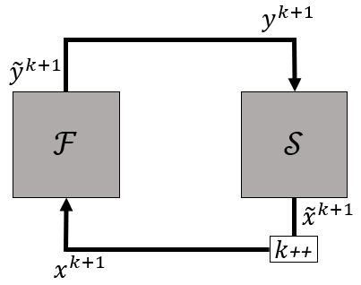
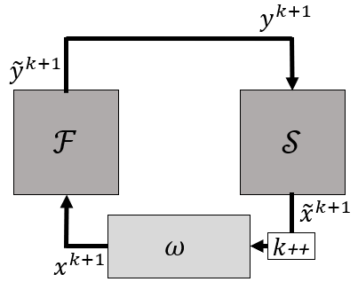
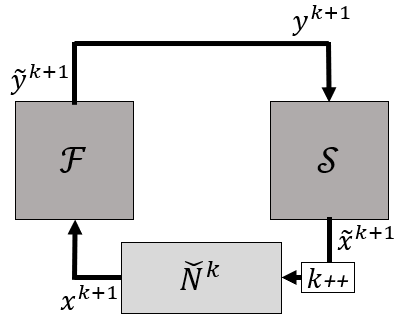

# Coupled solvers

This documentation describes the coupled solvers that are available.
A coupled solver refers to a coupling algortihm used to couple the two solvers.
Some coupled solvers implement one or more models.
An odd one out is `test_single_solver` which allows to test only one solver by coupling it to a dummy solver. 
All coupled solvers inherit from `gauss_seidel`.

In the parameter JSON file, the dictionary `coupled_solver` holds the `type` and the dictionary `settings`,
but also `predictor`, `convergence_criterion` and `solver_wrappers`.
More information on these last three can be found in respectively [predictors](../predictors/predictors.md),
[convergence_criteria](../convergence_criteria/convergence_criteria.md) and the `solver_wrappers` documentation.

## GaussSeidel

### Algorithm

Gauss-Seidel iterations are the simplest way of coupling two solvers.
In this coupling method fixed point iterations are performed as the output of one solver is given to the other one without adjustment.

Basic schematic is given in the following figure.

Here, $\mathcal{F}$ is the first solver with input $x$ and output $\tilde{y}$ 
and $\mathcal{S}$ is the second solver with input $y$ and output $\tilde{x}$

Gauss-Seidel iterations are very simple, but unstable for cases with high added mass.

### Settings

The following parameters need to be included in the `settings` dictionary.
Here they are listed in alphabetical order.

parameter|type|description
---:|:---:|---
`delta_t`|double|Fixed time step size used in both solvers. For a steady simulation typically a value of 1 is taken.
`name`|string|(optional) Name of the case used to store a pickle file with results. If not provided 'results' is used.
`save_results`|bool|(optional) Default: false. If true a pickle file is stored containing some main results: the value of the displacement and load on the interface for every time step, interface objects used by the two solvers, the number of coupling iterations per time step, the total elapsed time for the calculation, the residual after every coupling iteration and the values of `delta_t` and `timestep_start`.  This file is used by the postprocessing files included with the test examples.
`time_step_start`|int|Time step number to (re)start a transient FSI calculation. If 0 is given, the simulation starts from scratch. Otherwise, the code looks for the relevant files to start from the corresponding time step. Not every solver implements restart, see the solver documentation for more information. For a steady simulation this should be 0.

`timestep_start` and `delta_t` are necessary parameters (also in a steady simulation), but can also defined in the solverwrapper directly (e.g. for standalone testing).
If they are defined both here and in the solver wrapper, then the former value is used and a warning is printed.

**These parameters should also be specified for the coupled solvers inheriting from `GaussSeidel`.**

## Relaxation

This coupled solvers inherits from `GaussSeidel`.

### Algorithm

Gauss-Seidel iterations are very simple, but are unstable for cases with high added mass.
An approach to mitigate this is applying relaxation, also called simple mixing.
In this coupling method the output of first solver is still given to the other one without adjustment, 
but the output of the second solver is relaxed as follows:
$$
x^{k+1}=(1-\omega)x^k+\omega\tilde{x}^k=x^k+\omega r^k
$$
with $x^k$ and $\tilde{x}^k$, respectively the input for the first solver and the output of the second solver in iteration $k$.
The difference between both is called the residual $r^k=\tilde{x}^k-x^k$.
The mixing or relaxation factor is $\omega$.

A symbolic schematic is given in the following figure.

Here, $\mathcal{F}$ is the first solver with input $x$ and output $\tilde{y}$ 
and $\mathcal{S}$ is the second solver with input $y$ and output $\tilde{x}$

A lower $\omega$ increases stability, but decreases convergence speed.

This method is again quite simple, but still often unstable for cases with high added mass.

### Settings

Besides the parameters required in `GaussSeidel`, the following parameters need to be included in the `settings` dictionary.
They are listed in alphabetical order.

parameter|type|description
---:|:---:|---
`omega`|double|Relaxation factor.

## Aitken

This coupled solvers inherits from `GaussSeidel`.

### Algorithm

Gauss-Seidel iterations are very simple, but are unstable for cases with high added mass.
An approach to mitigate this is applying relaxation.
However, the choice of a relaxation factor can be difficult.
In this coupling method a dynamic relaxation factor is used.
The output of first solver is still given to the other one without adjustment, 
but the output of the second solver is relaxed as follows:
$$
x^{k+1}=(1-\omega^k)x^k+\omega^k\tilde{x}^k=x^k+\omega^k r^k
$$
with $x^k$ and $\tilde{x}^k$, respectively the input for the first solver and the output of the second solver in iteration $k$.
The difference between both is called the residual $r^k=\tilde{x}^k-x^k$.
The mixing or relaxation factor is $\omega^k$ is dynamic in the sense that its value changes between iterations.

A symbolic schematic is given in the following figure.

Here, $\mathcal{F}$ is the first solver with input $x$ and output $\tilde{y}$ 
and $\mathcal{S}$ is the second solver with input $y$ and output $\tilde{x}$

The value of $\omega^k$ is determined by applying the secant method for scalars directly to vectors and projecting it on $r^k-r^{k-1}$
as follows
$$
\omega^k=-\omega^{k-1}\frac{(r^{k-1})^T(r^k-r^{k-1})}{(r^k-r^{k-1})^T(r^k-r^{k-1})}.
$$

The first relaxation factor in a time step is equal to the last relaxation factor from the previous time step $\omega^n$, but limited to $\omega^{max}$.
$$
\omega^0=\textrm{sign}(\omega^n)\min(|\omega^n|,\omega^{max}).
$$
The relaxation factor in the first time step is equal to $\omega^{max}$.

This method improves convergence speed drastically compared to Gauss-Seidel iterations,
but even faster convergence can be obtained using quasi-Newton methods which take into account sensitivities.

### Settings

Besides the parameters required in `GaussSeidel`, the following parameters need to be included in the `settings` dictionary.
They are listed in alphabetical order.

parameter|type|description
---:|:---:|---
`omega_max`|double|Maximal relaxation factor.

## IQNI

This coupled solvers inherits from `GaussSeidel`.

### Algorithm

The abbreviation IQNI refers to _interface quasi-Newton with inverse Jacobian_.
In this type of coupling iteration, the combination of the two solvers is seen as one system.
The input of the first solver in iteration $k$ is denoted by $x^k$.
The output of this solver is transferred unchanged to the second solver.
The output of the second solver is denoted $\tilde{x}^k$.
The difference between input and output is called the residual $r^k=\tilde{x}^k-x^k$.

A residual operator $\mathcal{R}(x)$ is defined which return the residual $r^k$ as a function of $x^k$.
The goal is to find $x$ for which $\mathcal{R}(x)=0$.
This system of non-linear equations is solved using Newton-Raphson iterations as follows
$$
x^{k+1}=x^k-\mathcal{R}'^{-1}(x^k)r^k,
$$
where $\mathcal{R}'$ is the Jacobian of $\mathcal{R}$. 
However, this Jacobian is not accessible and is therefore approximated.

Note that the iteration update can also be written as
$$
\Delta x^k=\mathcal{R}'^{-1}(x^k)\Delta r^k;
$$
where $\Delta x^k=x^{k+1}-x^k$ is the difference between the input of two subsequent iterations 
and $\Delta r^k=0-r^k=-r^k$ is the difference between the desired and the current residual. 
Likewise, $\Delta\tilde{x}^k=\tilde{x}^{k+1}-\tilde{x}^k$ is the difference between the the output of two subsequent iterations.

Instead of approximating $\mathcal{R}'^{-1}$ directly, the inverse Jacobian of $\tilde{\mathcal{R}}$ is approximated.
This altered residual operator is defined as follows
$$
r^{k+1}=\tilde{\mathcal{R}}(\tilde{x}^{k+1})=\mathcal{R}(\tilde{x}^{k+1}-r^{k+1}).
$$
The inverse of both Jacobians are linked by
$$
\tilde{\mathcal{R}}'^{-1}=\mathcal{R}'^{-1}+I,
$$
where $\tilde{\mathcal{R}}'$ is the Jacobian of $\tilde{\mathcal{R}}$ with respect to $\tilde{x}$ and $I$ is the identity matrix.
For this Jacobian the following is valid
$$
\Delta \tilde{x}^k=\tilde{\mathcal{R}}'^{-1}(x^k)\Delta r^k.
$$
This Jacobian is also not known, but is approximated using a `model` denoted by $\tilde{N}^k$.
The type of `model` and its settings are specified in the `settings` dictionary.
This model returns an estimation of $\Delta\tilde{x}^k$ given $\Delta r^k=-r^k$
$$
\Delta\tilde{x}^k=\tilde{N}^k \Delta r^k.
$$
Finally resulting in the update formula
$$
x^{k+1}=x^k+(\tilde{N}^k-I)\Delta r^k=x^k-\tilde{N}^k r^k+r^k.
$$

A symbolic schematic is given in the following figure.

Here, $\mathcal{F}$ is the first solver with input $x$ and output $\tilde{y}$ 
and $\mathcal{S}$ is the second solver with input $y$ and output $\tilde{x}$

For more information refer to [models](models/models.md).

### Settings

Besides the parameters required in `GaussSeidel`, the following parameters need to be included in the `settings` dictionary.
They are listed in alphabetical order.

parameter|type|description
---:|:---:|---
`model`|dict|Model component.
`omega`|double|Relaxation factor.

## IBQN

This coupled solvers inherits from `GaussSeidel`.

### Algorithm

The abbreviation IBQN refers to _interface block quasi-Newton_.
In type of coupling iteration, the system 
$$
\begin{cases}
    \mathcal{F}(x)-y=0
    \newline
    \mathcal{S}(y)-x=0
\end{cases}
$$
is solved in block form.
Here, $\mathcal{F}$ is the first solver with input $x$ and output $\tilde{y}$ 
and $\mathcal{S}$ is the second solver with input $y$ and output $\tilde{x}$
In this iteration scheme, the output of each solver is altered before being transferred to the other one.
Solving the system in block Newton-Raphson iterations results in
$$
	\begin{bmatrix}
		\mathcal{F}'(x) & -I
		\newline
		-I &   \mathcal{S}'(y)
	\end{bmatrix}
	\begin{bmatrix}
		\Delta x
		\newline
		\Delta y
	\end{bmatrix}
	=-
	\begin{bmatrix}
		\mathcal{F}(x)-y
		\newline
		\mathcal{S}(y)-x
	\end{bmatrix},
$$
where $\mathcal{F}'$ and $\mathcal{S}'$ denote the Jacobians of the first and second solver, respectively.
These Jacobians are however not accessible and are approximated using a `model` as specified in the `settings` dictionary.
To the fist and second solver correspond `model_f`, denoted here by $M_f$, and `model_s`, denoted bye $M_s$, respectively.
For example, `model_f` returns an estimation of $\Delta\tilde{y}^k=\tilde{y}^{k+1}-\tilde{y}^k$ given $\Delta x^k=x^{k+1}-x^k$
$$
\Delta\tilde{y}^k=M_f^k \Delta x^k.
$$

Solving for $x^{k+1}=x^k+\Delta x^k$ requires solving the system
$$
\left(I-M_s^k M_f^k\right)\Delta x^k
=\tilde{x}^k-x^k+M_s^k(\tilde{y}^k-y^k)
$$
for $\Delta x^k$.
This done matrix-free using a GMRES method.
Analogously, the input $y^{k+1}=y^k+\Delta y^k$ for the structural solver by solving 
$$
\left(I-M_f^{k+1}M_s^k\right)\Delta y^k
=\tilde{y}^{k+1}-y^k+M_f^{k+1}(\tilde{x}^k-x^{k+1})
$$
for $\Delta y^k$.

A symbolic schematic is given in the following figure.

For more information refer to .

### Settings

Besides the parameters required in `GaussSeidel`, the following parameters need to be included in the `settings` dictionary.
They are listed in alphabetical order.

parameter|type|description
---:|:---:|---
`absolute_tolerance_gmres`|double|Absolute tolerance used in the GMRES method.
`model_f`|dict|Model component corresponding to the first solver wrapper.
`model_s`|dict|Model component corresponding to the second solver wrapper.
`omega`|double|Relaxation factor.
`relative_tolerance_gmres`|double|Relative tolerance used in the GMRES method.

## Test single solver

The solver `test_single_solver` can be used to test new cases and settings.
The idea behind this component is to only test one of the two solvers, while the other one is replaced by a dummy.
This test environment inherits from `GaussSeidel`. 

### Settings

The JSON settings for this `test_single_solver` are largely the same as in `coupled_solvers`, namely
the `type` and the  dictionaries  `settings`, `predictor`, `convergence_criterion` and `solver_wrappers`.
The entry for `type` is `test_single_solver`, the `settings` that one wants to use in the actual simulation, can be kept, but are not used.
Additionally to these directories, a mandatory directory `test_settings` has to be defined as well.
An illustration can be found in the example [test_single_solver](../../examples/test_single_solver/test_single_solver.md.
The possibilities for the `test_settings` directory are listed in alphabetical order below.

parameter|type|description
---:|:---:|---
`delta_t`|double|(optional) Time step size to be used in the test. Is optional as long as this value is defined in the `settings` dictionary. If a different value is defined in both dictionaries, the one defined in `test_settings` is chosen.
`solver_index`|int|Has a value 0 or 1 and indicates the solver that one wants to test. 0 indicates the first solver wrapper that appears in the JSON-file, 1 the second wrapper.
`test_class`|string|(optional) Refers to the class to use in the `dummy_solver.py` file in your case (for more information, see [example case](../../examples/test_single_solver/test_single_solver.md)).
`timestep_start`|int|(optional) Time step to start from. In this test environment, this is set to 0 by default.

Note that `test_settings` overwrites some parameters defined in `settings`. As such, these dictionaries are completely 
independent. This allows the user to set up a normal case but instead of running a full simulation, a test can easily be 
set up by only adding this `test_settings` dictionary and setting the `type` of `coupled_solvers` to `test_single_solver`.

An attentive reader will notice that in the example case, an additional parameter `check_mapping` is defined. This 
allows to test the mappers as well but this feature is currently not implemented and as such, this value is not used.

In your case directory where the simulation is run, a python file `dummy_solver.py` should be present that contains
at least one `test_class`. These classes allow to define forces or displacement on your structure and acts as "second
solver" to the problem. If this file is not present or `test_class` is not defined in `test_settings`, zero input will
be used. If `dummy_solver.py` does not contain the `test_class` defined in `test_settings`, an error will occur.

### Algorithm

The initialization starts with checking whether or not `dummy_solver.py` is present. If not, a boolean `bool_test` is set
to `False` and a message is printed that the input will be used. Then, the presence of `test_settings` is checked and
the parameters are set. Note once more that the parameters in `test_settings` have priority over these defined in `settings`.
Furthermore, only `delta_t` is of interest. Other `settings` are ignored, `timestep_start` is set to 0 and `save_results` 
to `False`.

As a next step, `delta_t` and `timestep_start` are added to the `settings` of the solver wrapper to be tested. The working
directory is copied to a new directory with the same name and a suffix `_testX` with `X` an integer starting from 0.  
Previous test working directories are not overwritten. The initialization finishes with informing the user that either
the `test_class` is used to provide input or, in absence of this parameter, a zero input will be used.

The `SolveSolutionStep` is fairly straightforward: if the boolean `bool_test` is true and a `test_class` was defined,
the `SolutionStepValue` of the nodes on the `interface_input` of the solver wrapper is set to the values defined in the
`test_class`. The `interface_output` of the solver wrapper is ignored. As such, this test environment can be considered
as one way FSI in some way.
