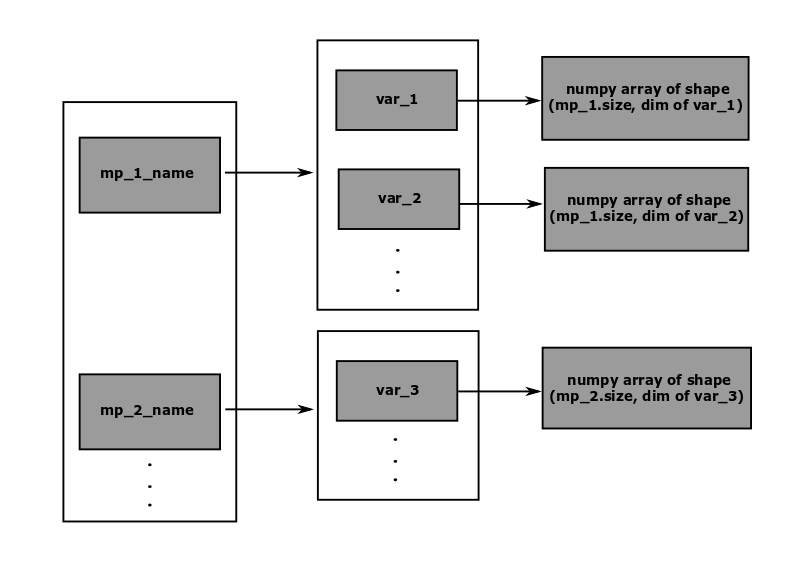

# Data Structure

The data structure in CoCoNuT contains different classes that serve as a container of various types of 
data that are transferred between the solvers during the partitioned coupling. It consist of 
following three classes:

-  `Model`
-  `ModelPart`
-  `Interface`

## Model
`Model` is simply a python `dict` with keys as model part names and values as reference to model parts. It serves as a 
container of instances of `ModelParts`. Additionally, it has one important method called 
`create_model_part`, which as the name suggests, creates an instance of the class `ModelPart` and adds 
it in the dictionary.

## ModelPart
`ModelPart` is basically a container of boundary points involved in the partitioned coupling. 
This contains the initial coordinates- `x0`, `y0`, `z0` (`1D numpy float array`) and point ids-
`id` (`1D numpy int array`). It is recommended to always create model parts using 
`create_model_part` method  of the class `Model`. Naturally, the size of `x0`, `y0`, `z0` and  `id` 
should be equal, which is checked in the `__init__` method.

---
**NOTE**: 
The data in `ModelPart` once created, either by `__init__` method of the class `ModelPart`or by 
`create_model_part` method  of the class `Model`, cannot be changed later. 
This is because the initial coordinates of boundary points are always supplied from the 
solver wrapper and they don't change during the coupling process. 
--- 

## Interface

`Interface` stores the variable data that are transferred between the different components of CoCoNuT 
to perform partitioned coupling. Additionally, it contains a reference to `Model`, usually created in 
the solver wrapper. As described above, the `Model` contains several model parts that are involved in 
the partitioned coupling. 

The data in the interfaces are stored as numpy arrays in a python `dict`. The following schematic 
illustrates the data structure in `Interface` class, where the arrow points from key to value in python `dict`: 

For example, in the schematic above the interface has a model part named 'mp_1_name', which has several 
variable data. The data for the variable `'var_1'` is stored in a numpy array with number of rows 
equal to the number points in the model part and number of columns equal the components/dimensions of the variable. The 
information on the number of dimensions is taken from the `variable_dimensions` `dict` defined 
in the file `data_structure/variables.py`, e.g the value for the variable `'pressure'`  and 
`'displacement'` are 1 and 3, respectively.  
The data in the interface can be accessed, added or replaced by the various methods implemented in `Interface` class.

---
**NOTE**: 
The file *`data_structure/variables.py`* does not contain any class definition. It has a `dict` 
called `variable_dimensions` with keys as data variable names (`string`), e.g. 'pressure' and values  as number of
components or dimesions (`int`). One important point to note is that only variables defined in this dictionary 
can be used in CoCoNuT. In order to use a new variable, the developer first needs to add the variable 
name and its number of components in this dictionary.

---
